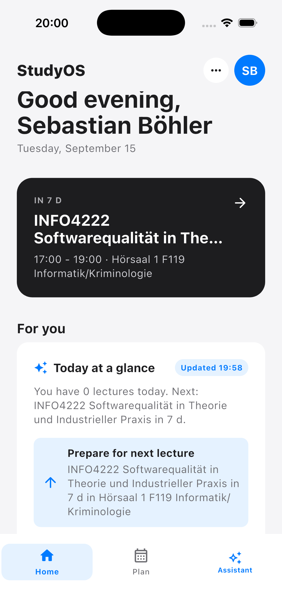
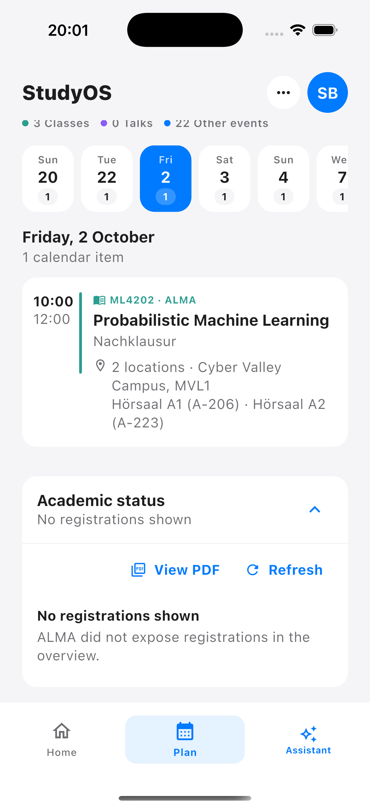
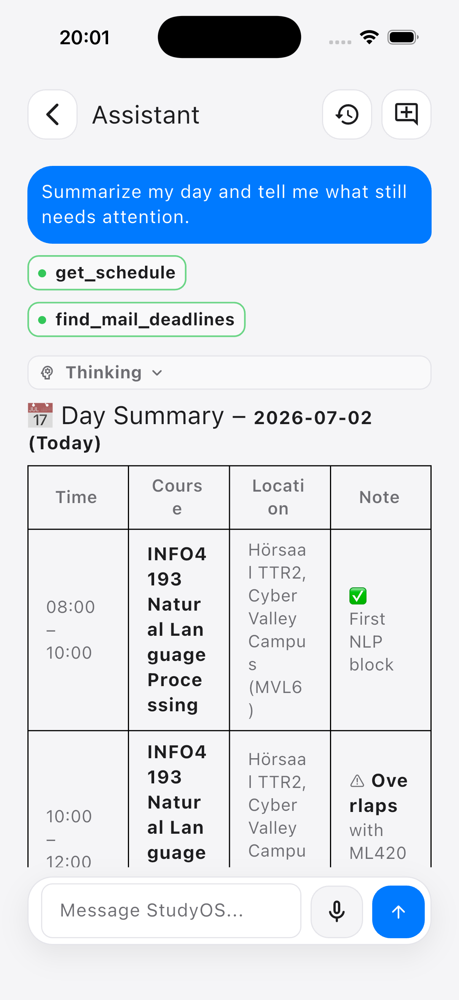
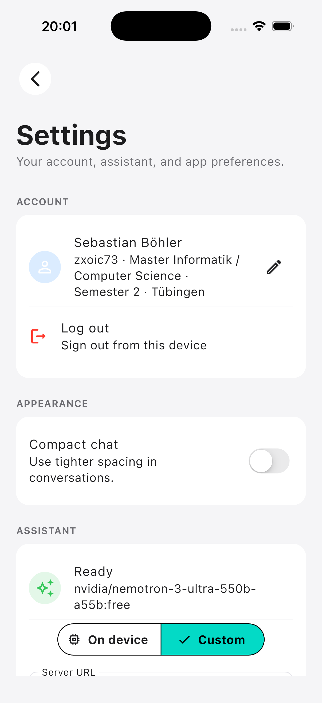

# StudyOS Agent

StudyOS Agent is a mobile study assistant for students at the University of
Tübingen. It brings university information into a Flutter application with a
personal overview, a study plan, and a conversational assistant that can use
university tools and display results as inline cards.

## Product Artifact — Course Submission

Developed for **Practical Machine Learning — Build your own Study OS**,
summer semester 2026. This repository documents the product; the group journey
portfolio and individual reflections are separate submissions.

**Start here:** [Product walkthrough](docs/product-walkthrough.md). It explains
the intended workflow and current limitations without requiring installation.
Source code is included for inspection; running the app is optional.

### Who it is for and what problem it addresses

The intended users are University of Tübingen students, particularly those still
learning which university systems contain the information they need. Course
information, schedules, tasks, and deadlines are spread across ALMA, ILIAS,
Moodle, and other services. The product aims to reduce both the navigation
between these systems and the complexity of finding relevant information.

### Main user workflow

1. Connect a university account and complete the student profile.
2. Open **Home** for the next lecture and a personalised information feed.
3. Open **Plan** to inspect the timetable and academic registration overview.
4. Use **Assistant** to ask about schedules, tasks, deadlines, or Mensa options.
   The agent can retrieve information through tools and present supported results
   as inline cards, alongside its answer.
5. Revisit conversations and edit personal context in **Notes**; manage model
   preferences in **Settings**.

The interface was simplified during the project: more functionality moved from
separate pages into assistant tools and inline cards. Home and Plan remain
explicit navigation destinations. See the [walkthrough](docs/product-walkthrough.md)
for a concrete example and links to the corresponding implementation.

### Product screenshots

Captured from the iPhone 17 Pro simulator on 15 September 2026. Click a screen
for the full-size image. These show the prototype's interface and account state;
the Assistant image contains an example conversation dated 2 July 2026.

| Home — next lecture and personal feed | Plan — calendar item and academic status |
| --- | --- |
| [](docs/assets/screenshots/home.png) | [](docs/assets/screenshots/plan.png) |
| **Assistant — example conversation and tool indicators** | **Settings — profile and model choice** |
| [](docs/assets/screenshots/assistant.png) | [](docs/assets/screenshots/settings.png) |

### Current state and limitations

This is a course prototype with implemented university integrations and native
Android/iOS code, not a claim of complete feature parity across platforms.

- Personal data requires a university account and working portal sessions.
  Changes to university pages or authentication can break integrations.
- Local inference depends on supported devices, operating systems, and model
  availability. Cloud inference requires the user's configured provider and key.
- University requests execute on the device. With cloud inference, selected
  study context and tool results are sent to the configured AI provider;
  choosing cloud mode is not an entirely local data flow.
- Web and desktop builds expose the Flutter interface but do not provide all
  native capabilities. A web build is not equivalent to the mobile experience.
- iOS distribution requires signing; macOS builds are not notarized. See the
  installation notes below for the available routes.
- Broader user testing, setup simplification, and distribution remain important
  next steps. This documentation is based on source inspection and the team's
  project account; it does not certify a fresh end-to-end test on every platform.

### Contents of this repository

| Material | Purpose |
| --- | --- |
| [Product walkthrough](docs/product-walkthrough.md) | User scenario, screen descriptions, and limitations |
| [Flutter app](flutter_app/) | Product implementation and native platform runners |
| [Developer instructions](flutter_app/README.md) | Running and inspecting the source |
| [Download page](https://tue-studyos.github.io/StudyOS_Agent/) | Installation entry point |
| [GitHub releases](https://github.com/Tue-StudyOS/StudyOS_Agent/releases) | Published build assets |

## Install A Release

Use the public download page:

```text
https://tue-studyos.github.io/StudyOS_Agent/
```

Or open the GitHub Releases page directly:

```text
https://github.com/Tue-StudyOS/StudyOS_Agent/releases
```

Recommended artifacts:

- Android: download `studyos-agent-*-android.apk`, allow installs from your
  browser or file manager when Android asks, then open the APK.
- Web: download `studyos-agent-web-*.zip` for iOS, macOS, Windows, Linux, or any
  machine where installing a native app is inconvenient.
- Desktop: Linux, macOS, and Windows archives are available for packaging
  checks. macOS builds are not notarized yet, so Gatekeeper may block them.
- iOS: no direct installable build is published yet. Real iOS distribution
  needs Apple Developer Program signing and TestFlight.

Run the release web bundle locally:

```sh
unzip studyos-agent-web-*.zip -d studyos-agent-web
cd studyos-agent-web
python3 -m http.server 8080
```

Then open `http://127.0.0.1:8080`. Do not open `index.html` directly from disk;
Flutter web must be served by a web server.

## Run From Source

Requirements:

- Flutter stable with Dart 3.12 or newer
- Android Studio or Android SDK for Android builds
- Chrome for web development
- Xcode only when running iOS or macOS locally

Clone and start the Flutter app:

```sh
git clone https://github.com/Tue-StudyOS/StudyOS_Agent.git
cd StudyOS_Agent/flutter_app
flutter pub get
flutter run -d chrome
```

Useful run targets:

```sh
flutter run -d chrome
flutter run -d android
flutter run -d macos
```

Build release artifacts locally:

```sh
flutter build web --release
flutter build apk --release
```

Serve the local web build:

```sh
python3 -m http.server 8080 --directory build/web
```

## Assistant Model Setup

On first run, the app seeds a replaceable OpenRouter endpoint/model preset:

```text
Endpoint: https://openrouter.ai/api/v1/chat/completions
Model: nvidia/nemotron-3-ultra-550b-a55b:free
```

GitHub push protection blocks committing OpenRouter keys, so release builds do
not contain a default API key. Open `Settings -> Assistant setup -> Custom` and
paste an OpenRouter key, or build with the Dart define shown below. To avoid
cloud calls, switch `Assistant` back to `On device` and use the local model
controls.

On Android, the built-in setup checks the AICore Gemini Nano configurations
supported by the current device, preselects an available configuration, and can
request an AICore-managed model download. Unsupported configurations stay hidden;
if AICore is unavailable, settings show one compact unsupported status. Custom
LiteRT-LM URL downloads remain available in a collapsed advanced section. On iOS,
the built-in provider uses Apple Foundation Models when the device supports it.

For local development builds, you can override the seeded preset without editing
source:

```sh
flutter run -d chrome \
  --dart-define=STUDYOS_DEMO_OPENROUTER_ENDPOINT=https://openrouter.ai/api/v1/chat/completions \
  --dart-define=STUDYOS_DEMO_OPENROUTER_MODEL=nvidia/nemotron-3-ultra-550b-a55b:free \
  --dart-define=STUDYOS_DEMO_OPENROUTER_API_KEY="$OPENROUTER_API_KEY"
```

### Assistant tool privacy

StudyOS executes university tools in the app for both on-device and cloud
models. Portal credentials, cookies, SAML fields, session keys, and raw HTML
remain on the device. When a cloud model requests `get_tasks` or
`get_deadlines`, the app sends only the sanitized tool result (such as titles,
courses, dates, and source links) back to the configured AI service so it can
answer the question. Use the on-device model when those results must not leave
the device.

## Migration Notes

- Flutter owns the main chat UI, input bar, status display, navigation, and
  settings surfaces.
- Android native code is copied into the Flutter Android runner and exposed
  through `MethodChannel` and `EventChannel` bridge hooks.
- Android keeps OS-level integrations such as services, reminders, sensors, app
  launching, speech/TTS, and LiteRT/LiteRTLM.
- iOS exposes native location/device state, local notification reminders, speech
  availability, text-to-speech, and Apple Foundation Models when the SDK/device
  supports the Foundation Models framework.
- Web and desktop currently run the Flutter UI shell. Unsupported native bridge
  calls return explicit errors instead of mock data.
